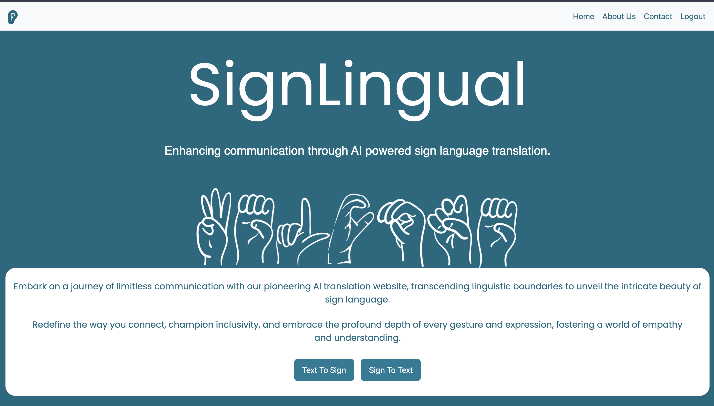
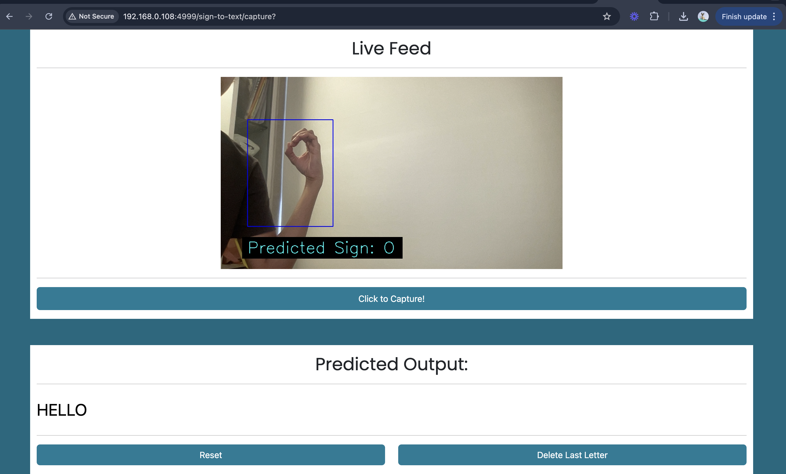
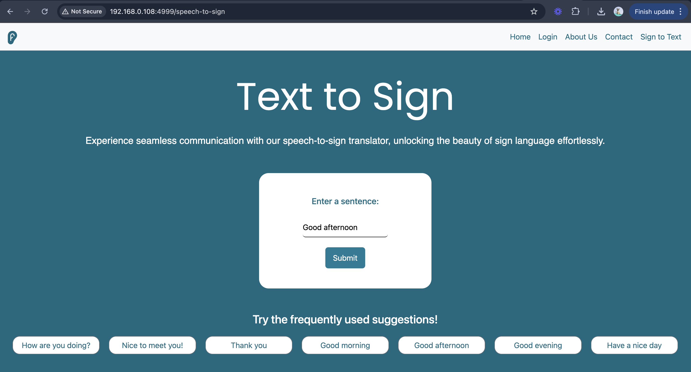
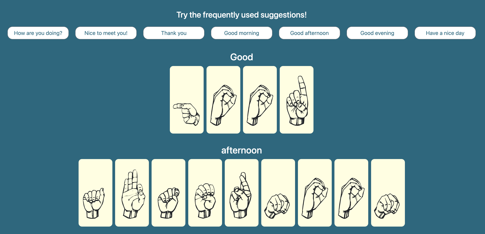

# SignLingual

**Developed in March 2024**

## Overview

SignLingual is a full-stack web application designed to bridge the communication gap between sign language users and those who don't understand it. Leveraging the power of machine learning, it offers two primary functionalities:

* **Sign to Text:** Users can input sign language and receive a text translation.
* **Text to Sign:** Users can input text and receive a visual representation of the corresponding sign language.

The application is built with a Python Flask backend serving a REST API, a machine learning model for ASL translation, and a user-friendly interface crafted with the Bootstrap framework.

### Home

### Sign to Text

### Text to Sign

## Key Features

* **RESTful API:** Flask backend provides a well-structured API for communication between the frontend and backend logic.
* **ASL Translation:** Integrates a machine learning model to translate American Sign Language.
* **Intuitive User Interface:** Clean and responsive design built with the Bootstrap framework.
* **Sign to Text Functionality:** Converts sign language input into textual output.
* **Text to Sign Functionality:** Generates visual representations of sign language from text input.
